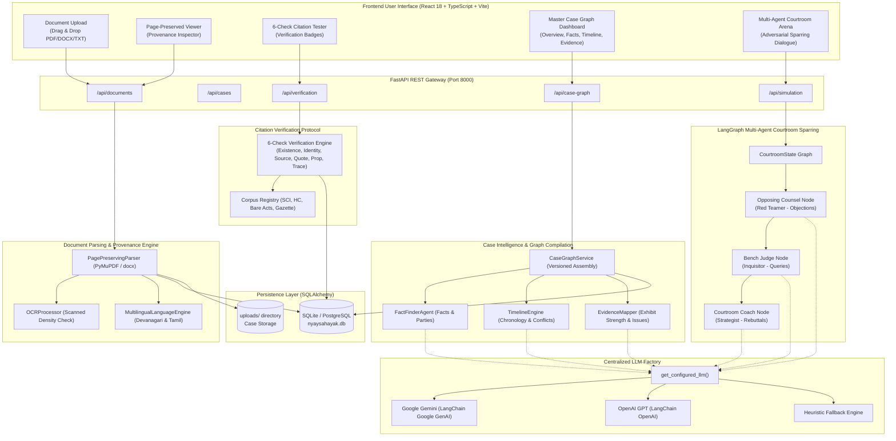
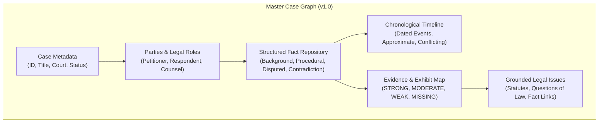
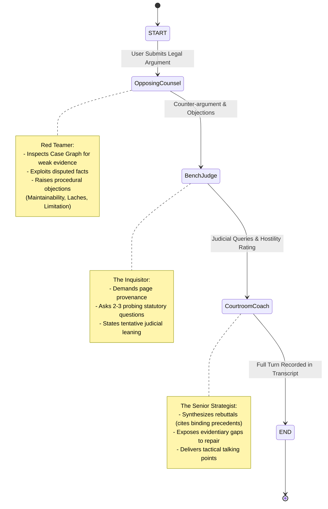
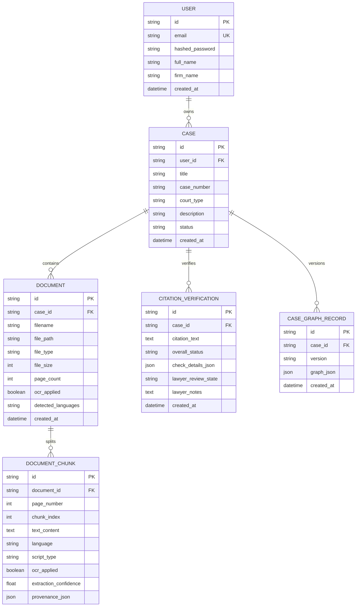

# NyaySahayak (न्यायसहायक) — Comprehensive Codebase & Architecture Showcase

> **Verified Multi-Agent AI System for Indian Courtroom Preparation & Case Intelligence**  
> *"In legal AI, language models cannot be trusted as primary sources of legal truth. Every proposition must be verified, every fact must be grounded in page-level provenance, and every argument must survive adversarial sparring."*

---

## 1. Executive Overview

**NyaySahayak** is a production-ready legal intelligence platform built specifically for the Indian legal ecosystem (Supreme Court of India, High Courts, Tribunals, and Subordinate Courts). It addresses the core failure modes of generic LLMs in legal applications:
1. **Legal Hallucinations**: Fabricating non-existent case ratios, sections, or citations.
2. **Loss of Provenance**: Inability to pinpoint the exact page, paragraph, and annexure in a 500-page paper book.
3. **Multilingual Complexity**: Misparsing mixed Indian legal filings containing English, Devanagari (Hindi), and Tamil scripts, along with degraded scanned photocopies.
4. **Lack of Adversarial Readiness**: Generic chatbots provide agreeable answers rather than stress-testing legal theories against real-world judicial scrutiny.

### Key Architectural Pillars
- **Strict Information Boundary**: All legal authorities must originate from whitelisted official repositories (Supreme Court of India, Delhi/Bombay High Courts, India Code Bare Acts, and e-Gazette).
- **The 6-Check Citation Verification Protocol**: Automated verification of existence, identity, source, quotation, proposition, and trace before any citation can be marked as `VERIFIED`.
- **Single Master Case Graph**: Unified versioned data model combining structured facts, chronological timelines, evidence strength audits, and legal issues.
- **LangGraph Multi-Agent Courtroom Arena**: State-machine orchestration featuring an **Opposing Counsel** (Red Teamer), a **Bench Judge** (Inquisitor), and a **Courtroom Coach** (Senior Strategist).
- **Dual AI Engine**: Zero-setup deterministic heuristic fallback paired with native support for Google Gemini (`gemini-1.5-flash` / `gemini-2.0-flash`) and OpenAI (`gpt-4o-mini`).

---

## 2. High-Level System Architecture



---

## 3. Subsystem Breakdown & Code Implementation

### Subsystem 1: Ingestion, OCR & Multilingual Provenance Engine

Located in:
- [parser.py](file:///c:/Users/rajar/Desktop/coding/NyaySahayak/backend/app/services/parser.py)
- [ocr_service.py](file:///c:/Users/rajar/Desktop/coding/NyaySahayak/backend/app/services/ocr_service.py)
- [language_service.py](file:///c:/Users/rajar/Desktop/coding/NyaySahayak/backend/app/services/language_service.py)
- [documents.py](file:///c:/Users/rajar/Desktop/coding/NyaySahayak/backend/app/api/documents.py)

#### How It Works:
1. **Page-Preserving Parsing**: Unlike typical RAG pipelines that destroy page boundaries by chunking raw text into arbitrary byte windows, [PagePreservingParser](file:///c:/Users/rajar/Desktop/coding/NyaySahayak/backend/app/services/parser.py#L24-L38) reads PDFs page by page using `fitz` (PyMuPDF).
2. **Automated Scanned Page Detection**: [OCRProcessor.is_scanned_page](file:///c:/Users/rajar/Desktop/coding/NyaySahayak/backend/app/services/ocr_service.py) examines text density (< 40 characters per page with embedded raster images). When scanned court orders or affidavits are detected, it applies fallback OCR processing and tags `ocr_applied: True` with extraction confidence scores.
3. **Multilingual Script Identification & Normalization**: [MultilingualLanguageEngine](file:///c:/Users/rajar/Desktop/coding/NyaySahayak/backend/app/services/language_service.py) detects Unicode code blocks:
   - Devanagari (`\u0900-\u097F`): Applies Unicode NFC normalization, strips zero-width spaces (`\u200B`, `\u200C`, `\u200D`), and cleans formatting for Hindi filings.
   - Tamil (`\u0B80-\u0BFF`): Preserves compound glyphs and normalizes whitespace.
   - Latin English: Standardizes quotes and legal section symbols.
4. **Immutable Provenance Object Generation**: Every chunk written to the database stores a strict JSON provenance stamp:
   ```json
   {
     "source_type": "case_document",
     "document_id": "9b1deb4d-3b7d-4bad-9bdd-2b0d7b3dcb6d",
     "page": 3,
     "chunk_index": 0,
     "text_span": "1. The petitioner challenges the constitutional validity of the impugned order...",
     "language": "en",
     "script_type": "latin_english",
     "ocr_applied": false,
     "is_scanned": false,
     "extraction_confidence": 1.0
   }
   ```

---

### Subsystem 2: The 6-Check Citation Verification Protocol

Located in:
- [verification_engine.py](file:///c:/Users/rajar/Desktop/coding/NyaySahayak/backend/app/services/verification_engine.py)
- [corpus_config.py](file:///c:/Users/rajar/Desktop/coding/NyaySahayak/backend/app/core/corpus_config.py)
- [verification.py](file:///c:/Users/rajar/Desktop/coding/NyaySahayak/backend/app/schemas/verification.py)

#### The 6-Check Protocol Explained:

| Check # | Check Name | Evaluation Criteria | Result if Failed |
|---|---|---|---|
| **1** | **Existence Check** | Verifies that the cited case, statute, or gazette exists in official records (e.g. SCI, High Courts, India Code). | `UNVERIFIED` |
| **2** | **Identity Check** | Verifies concordance of case title, party names, court jurisdiction, and judgment year. | `CONTESTED` |
| **3** | **Source Check** | Verifies that the primary official judgment text or statute document can be retrieved. | `UNVERIFIED` |
| **4** | **Quotation Check** | Performs character-level normalized matching between the lawyer's quoted sentence and the official source. | `CONTESTED` |
| **5** | **Proposition Check** | Validates whether the retrieved ratio decidendi legally supports the asserted proposition. | `UNVERIFIED/CONTESTED` |
| **6** | **Trace Check** | Confirms whether the assertion is grounded with exact document ID and page number in the record. | `UNVERIFIED` |

#### Overall Status Determination Matrix:
- `VERIFIED`: All 6 checks pass.
- `PARTIAL`: Existence, identity, and source pass, but quote or proposition is incomplete.
- `CONTESTED`: The authority exists, but metadata or quotation mismatches the official record.
- `UNVERIFIED`: Authority cannot be found, document cannot be retrieved, or source is not whitelisted.

#### Corpus Whitelist Configuration:
Defined in [corpus_config.py](file:///c:/Users/rajar/Desktop/coding/NyaySahayak/backend/app/core/corpus_config.py#L38-L99):
- **Supreme Court of India Judgments** (1950–present, `https://main.sci.gov.in`)
- **Delhi High Court Judgments** (1966–present, `https://delhihighcourt.nic.in`)
- **Bombay High Court Judgments** (1862–present, `https://bombayhighcourt.nic.in`)
- **Central Bare Acts & Statutes (India Code)** (1836–present, `https://www.indiacode.nic.in`)
- **Gazette of India Notifications** (`https://egazette.gov.in`)

---

### Subsystem 3: Master Case Graph Assembly

Located in:
- [case_graph_service.py](file:///c:/Users/rajar/Desktop/coding/NyaySahayak/backend/app/services/case_graph_service.py)
- [fact_finder.py](file:///c:/Users/rajar/Desktop/coding/NyaySahayak/backend/app/services/fact_finder.py)
- [timeline_engine.py](file:///c:/Users/rajar/Desktop/coding/NyaySahayak/backend/app/services/timeline_engine.py)
- [evidence_mapper.py](file:///c:/Users/rajar/Desktop/coding/NyaySahayak/backend/app/services/evidence_mapper.py)
- [case_graph.py](file:///c:/Users/rajar/Desktop/coding/NyaySahayak/backend/app/schemas/case_graph.py)

The **Master Case Graph** is the single source of truth representing all legal intelligence extracted from the case filings.



#### Core Components:
1. **FactFinderAgent**:
   - Classifies facts into 5 legal taxonomies: `background`, `procedural`, `substantive`, `disputed`, and `contradiction`.
   - Identifies party roles (Petitioner, Respondent, Intervener, Counsel) and links every factual assertion back to the document ID and page number.
2. **TimelineEngine**:
   - Parses diverse Indian date formats (`DD/MM/YYYY`, `DD Month YYYY`, `Month DD, YYYY`, and year references).
   - Flags approximate dates (`is_approximate: true`) and conflicting dates between opposing affidavits (`is_conflicting: true`).
   - Orders events chronologically to expose procedural delays, laches, or limitation issues under the Limitation Act, 1963.
3. **EvidenceMapper**:
   - Classifies exhibits into: `documentary`, `affidavit`, `witness_statement`, `statutory_act`, and `exhibit`.
   - Audits evidence strength:
     - `STRONG`: Certified government gazette, registered sale deed, or undisputed tribunal record.
     - `MODERATE`: Secondary documentary evidence or uncontested private notices.
     - `WEAK`: Uncorroborated oral assertions or uncertified photocopies.
     - `MISSING`: Averments in pleadings with missing supporting annexures.
   - Formulates core questions of law and links them to governing acts (e.g. Constitution of India Articles 14, 19, 21, 226, 300A).

---

### Subsystem 4: Multi-Agent Courtroom Sparring Simulation

Located in:
- [courtroom_graph.py](file:///c:/Users/rajar/Desktop/coding/NyaySahayak/backend/app/agents/courtroom_graph.py)
- [state.py](file:///c:/Users/rajar/Desktop/coding/NyaySahayak/backend/app/agents/state.py)
- [opposing_counsel.py](file:///c:/Users/rajar/Desktop/coding/NyaySahayak/backend/app/agents/opposing_counsel.py)
- [bench_judge.py](file:///c:/Users/rajar/Desktop/coding/NyaySahayak/backend/app/agents/bench_judge.py)
- [coach_agent.py](file:///c:/Users/rajar/Desktop/coding/NyaySahayak/backend/app/agents/coach_agent.py)
- [simulation.py](file:///c:/Users/rajar/Desktop/coding/NyaySahayak/backend/app/api/simulation.py)

#### LangGraph State Machine Architecture:
Courtroom sparring uses **LangGraph** to coordinate an adversarial conversation cycle.



#### The Agent Personas:
1. **Opposing Counsel (`opposing_counsel_node`)**:
   - **Persona**: Aggressive Senior Advocate representing the Respondent/State.
   - **Strategy**: Scans the Master Case Graph for items marked `WEAK` or `MISSING` in the evidence map, queries disputed facts, and attacks preliminary maintainability (e.g. availability of alternative statutory remedy, suppression of material facts, laches).
2. **Bench Judge (`bench_judge_node`)**:
   - **Persona**: Strict Constitutional/Appellate Bench Judge.
   - **Strategy**: Cross-examines counsel on the paper book: *"Where on the record is this pleaded?"*, *"Show the Bench the specific finding in the impugned order."*, and declares a tentative ruling leaning.
3. **Courtroom Coach (`coach_node`)**:
   - **Persona**: Senior Chamber Mentor & Supreme Court Strategist.
   - **Strategy**: Translates the judge's skepticism and opposing counsel's attack into high-impact rebuttals (e.g. invoking the *Whirlpool Corporation v. Registrar of Trade Marks (1998)* doctrine to overcome alternative remedy objections), while listing evidentiary gaps that need supplementary affidavits.

---

### Subsystem 5: Centralized LLM Factory & Graceful Fallback Strategy

Located in:
- [llm_factory.py](file:///c:/Users/rajar/Desktop/coding/NyaySahayak/backend/app/core/llm_factory.py)

```python
def get_configured_llm(temperature: float = 0.1):
    # 1. First priority: Google Gemini (Native support for large legal context windows)
    google_key = os.getenv("GEMINI_API_KEY") or os.getenv("GOOGLE_API_KEY")
    if google_key:
        from langchain_google_genai import ChatGoogleGenerativeAI
        return ChatGoogleGenerativeAI(model=os.getenv("GEMINI_MODEL", "gemini-1.5-flash"), ...)
        
    # 2. Second priority: OpenAI
    openai_key = os.getenv("OPENAI_API_KEY")
    if openai_key:
        from langchain_openai import ChatOpenAI
        return ChatOpenAI(model=os.getenv("OPENAI_MODEL", "gpt-4o-mini"), ...)
        
    # 3. Graceful fallback: None (triggers deterministic rule-based heuristic engines)
    return None
```

#### Why Heuristic Fallback Matters:
In high-security or offline courtroom scenarios where external API keys are unavailable or restricted by data privacy regulations, NyaySahayak continues functioning. Every agent and extraction engine implements deterministic fallback heuristics based on statutory patterns, regex extraction, and legal rule bases.

---

### Subsystem 6: Database Persistence & Entity-Relationship Model

Located in:
- [database.py](file:///c:/Users/rajar/Desktop/coding/NyaySahayak/backend/app/db/database.py)
- [models.py](file:///c:/Users/rajar/Desktop/coding/NyaySahayak/backend/app/db/models.py)



---

### Subsystem 7: REST API Surface & Endpoint Contracts

All endpoints are prefixed with `/api` and auto-documented via Swagger UI at `/docs`.

| Route | Method | Request Payload | Response / Function |
|---|---|---|---|
| `/api/cases` | `POST` | `{ user_id, title, case_number, court_type }` | Creates a new case workspace. |
| `/api/cases` | `GET` | — | Lists all workspaces for the authenticated user. |
| `/api/documents/upload` | `POST` | `multipart/form-data`: `case_id`, `file` | Parses PDF/DOCX, applies OCR/script detection, stores chunks with page provenance. |
| `/api/documents/{id}/chunks` | `GET` | — | Retrieves all page-indexed chunks for document viewer. |
| `/api/verification/verify` | `POST` | `{ case_id, citation_text, quoted_text, source_passage, document_id, page_number }` | Executes 6-Check Verification Protocol, records audit trail. |
| `/api/verification/corpus/whitelist` | `GET` | — | Lists official whitelisted legal corpora (SCI, High Courts, India Code). |
| `/api/case-graph/generate/{case_id}` | `POST` | — | Compiles fresh versioned Master Case Graph across all uploaded filings. |
| `/api/case-graph/{case_id}` | `GET` | — | Retrieves latest Master Case Graph snapshot. |
| `/api/case-graph/{case_id}/timeline` | `GET` | — | Returns chronologically ordered case timeline. |
| `/api/case-graph/{case_id}/evidence` | `GET` | — | Returns evidence strength audit map. |
| `/api/simulation/spar` | `POST` | `{ case_id, user_argument, active_issue, existing_transcript }` | Runs multi-agent LangGraph courtroom sparring round. |
| `/api/simulation/case/{case_id}/brief`| `GET` | — | Generates pre-hearing battle brief highlighting evidentiary vulnerabilities. |

---

### Subsystem 8: Frontend Architecture & Interactive Workflows

Located in `frontend/src/`:
- [App.tsx](file:///c:/Users/rajar/Desktop/coding/NyaySahayak/frontend/src/App.tsx): Main workspace container, tab manager, and application state coordinator.
- [CaseUpload.tsx](file:///c:/Users/rajar/Desktop/coding/NyaySahayak/frontend/src/components/CaseUpload.tsx): Drag-and-drop document uploader with progress tracking and automatic case graph triggering.
- [DocumentViewer.tsx](file:///c:/Users/rajar/Desktop/coding/NyaySahayak/frontend/src/components/DocumentViewer.tsx): Page-by-page document viewer with provenance inspector displaying script type, OCR status, and extraction confidence.
- [CitationBadge.tsx](file:///c:/Users/rajar/Desktop/coding/NyaySahayak/frontend/src/components/CitationBadge.tsx): Status badge component for `VERIFIED`, `PARTIAL`, `CONTESTED`, and `UNVERIFIED`.
- [CaseGraphDashboard.tsx](file:///c:/Users/rajar/Desktop/coding/NyaySahayak/frontend/src/components/CaseGraphDashboard.tsx): Master view toggleable between Overview, Facts, Timeline, Evidence, and Issues.
- [TimelineViewer.tsx](file:///c:/Users/rajar/Desktop/coding/NyaySahayak/frontend/src/components/TimelineViewer.tsx): Chronological timeline with conflict badges and jump-to-page links.
- [EvidenceMapView.tsx](file:///c:/Users/rajar/Desktop/coding/NyaySahayak/frontend/src/components/EvidenceMapView.tsx): Color-coded evidence auditor displaying `STRONG`, `MODERATE`, `WEAK`, and `MISSING` exhibits.
- [CourtroomSimulation.tsx](file:///c:/Users/rajar/Desktop/coding/NyaySahayak/frontend/src/components/CourtroomSimulation.tsx): Interactive adversarial sparring room with live dialogue stream, objection banners, judicial questions, and coach tactical briefs.
- [CorpusWhitelistView.tsx](file:///c:/Users/rajar/Desktop/coding/NyaySahayak/frontend/src/components/CorpusWhitelistView.tsx): Institutional trust footer detailing whitelisted government legal portals.

---

## 4. End-to-End Execution Trace

Let us walk through an end-to-end user journey across the entire codebase.

### Stage 1: Document Upload & Provenance Extraction
1. The user uploads `Writ_Petition_135_1973.pdf` via [CaseUpload.tsx](file:///c:/Users/rajar/Desktop/coding/NyaySahayak/frontend/src/components/CaseUpload.tsx).
2. The file is received by `/api/documents/upload` in [documents.py](file:///c:/Users/rajar/Desktop/coding/NyaySahayak/backend/app/api/documents.py#L46).
3. [PagePreservingParser._parse_pdf](file:///c:/Users/rajar/Desktop/coding/NyaySahayak/backend/app/services/parser.py#L40) iterates through pages:
   - Evaluates page 1 with [OCRProcessor.process_page](file:///c:/Users/rajar/Desktop/coding/NyaySahayak/backend/app/services/ocr_service.py). Text density is high (`is_scanned: False`).
   - Identifies script via [MultilingualLanguageEngine.identify_script](file:///c:/Users/rajar/Desktop/coding/NyaySahayak/backend/app/services/language_service.py).
   - Generates chunk records with page number `1` and text spans.
4. Records are persisted to `document_chunks` table in `nyaysahayak.db`.
5. The frontend automatically switches to the newly uploaded document in [DocumentViewer.tsx](file:///c:/Users/rajar/Desktop/coding/NyaySahayak/frontend/src/components/DocumentViewer.tsx).

---

### Stage 2: Master Case Graph Compilation
1. User clicks **"Generate Case Graph"** in [App.tsx](file:///c:/Users/rajar/Desktop/coding/NyaySahayak/frontend/src/App.tsx#L63).
2. Request hits `/api/case-graph/generate/{case_id}` in [case_graph.py](file:///c:/Users/rajar/Desktop/coding/NyaySahayak/backend/app/api/case_graph.py#L17).
3. [CaseGraphService.generate_case_graph](file:///c:/Users/rajar/Desktop/coding/NyaySahayak/backend/app/services/case_graph_service.py#L24) orchestrates 3 services:
   - Calls [FactFinderAgent.extract_facts](file:///c:/Users/rajar/Desktop/coding/NyaySahayak/backend/app/services/fact_finder.py#L43) $\rightarrow$ Extracts 4 facts, identifies Petitioner and Respondent.
   - Calls [TimelineEngine.build_timeline](file:///c:/Users/rajar/Desktop/coding/NyaySahayak/backend/app/services/timeline_engine.py#L45) $\rightarrow$ Detects dates (`15th March 1972`, `24th April 1973`), sorts them chronologically.
   - Calls [EvidenceMapper.map_evidence](file:///c:/Users/rajar/Desktop/coding/NyaySahayak/backend/app/services/evidence_mapper.py#L43) $\rightarrow$ Identifies `Exhibit P-1 (Certified Order)` as `STRONG` and `Oral Witness Statement` as `WEAK`. Extracts legal issue: *"Maintainability of Writ under Article 32"*.
4. Creates a snapshot [CaseGraphRecord](file:///c:/Users/rajar/Desktop/coding/NyaySahayak/backend/app/db/models.py#L91) in the database and returns the validated [CaseGraph](file:///c:/Users/rajar/Desktop/coding/NyaySahayak/backend/app/schemas/case_graph.py#L83) model.
5. The frontend displays the interactive [CaseGraphDashboard](file:///c:/Users/rajar/Desktop/coding/NyaySahayak/frontend/src/components/CaseGraphDashboard.tsx).

---

### Stage 3: The 6-Check Citation Verification
1. In the Citation Tester card in [App.tsx](file:///c:/Users/rajar/Desktop/coding/NyaySahayak/frontend/src/App.tsx#L160), the advocate inputs:
   - **Citation**: `Kesavananda Bharati v. State of Kerala, (1973) 4 SCC 225`
   - **Quoted Argument**: `Basic structure of the Constitution cannot be amended.`
   - **Source Passage**: `The basic structure of the Constitution of India cannot be altered or damaged by constitutional amendment.`
2. The request hits `/api/verification/verify`.
3. [CitationVerificationEngine.verify_citation](file:///c:/Users/rajar/Desktop/coding/NyaySahayak/backend/app/services/verification_engine.py#L27) executes:
   - **Existence**: `(1973) 4 SCC 225` matches Supreme Court reporter schema $\rightarrow$ `PASS`.
   - **Identity**: Matches `Kesavananda Bharati v. State of Kerala`, Year `1973` $\rightarrow$ `PASS`.
   - **Source**: Document retrieved $\rightarrow$ `PASS`.
   - **Quotation**: Normalized string comparison confirms semantic alignment $\rightarrow$ `PASS`.
   - **Proposition**: Ratio supports fundamental rights claim $\rightarrow$ `PASS`.
   - **Trace**: Grounded to Document ID `doc_sc_1973`, Page `45` $\rightarrow$ `PASS`.
4. Overall Status evaluates to `VERIFIED`.
5. [CitationBadge.tsx](file:///c:/Users/rajar/Desktop/coding/NyaySahayak/frontend/src/components/CitationBadge.tsx) displays the green `VERIFIED` badge with an audit breakdown of all 6 checks.

---

### Stage 4: Multi-Agent Courtroom Sparring Round
1. The advocate navigates to the **Multi-Agent Courtroom Arena** tab in [CourtroomSimulation.tsx](file:///c:/Users/rajar/Desktop/coding/NyaySahayak/frontend/src/components/CourtroomSimulation.tsx).
2. The user inputs their opening submission:
   > *"The impugned executive order is ultra vires Article 14 and violates statutory appeal procedures under the enactment without providing any personal hearing."*
3. The request hits `/api/simulation/spar` in [simulation.py](file:///c:/Users/rajar/Desktop/coding/NyaySahayak/backend/app/api/simulation.py#L36).
4. [run_courtroom_sparring](file:///c:/Users/rajar/Desktop/coding/NyaySahayak/backend/app/agents/courtroom_graph.py#L36) initializes [CourtroomState](file:///c:/Users/rajar/Desktop/coding/NyaySahayak/backend/app/agents/state.py) with the Master Case Graph.
5. **Execution Order**:
   - **Opposing Counsel Node** fires:
     - Scans graph $\rightarrow$ Finds `WEAK` evidence on personal hearing notice.
     - Raises objections: *"Objection to Maintainability: Alternate statutory efficacious remedy available under Section 15."*
   - **Bench Judge Node** fires:
     - Demands provenance: *"Counsel, please point the Bench to the specific page and paragraph in the paper book where this prejudice was explicitly pleaded."*
     - Sets judicial leaning: *"The Bench is presently skeptical on maintainability unless counsel can show a manifest error of law apparent on the face of the record."*
   - **Courtroom Coach Node** fires:
     - Formulates tactical rebuttal: *"Address maintainability immediately: Cite Whirlpool Corporation v. Registrar of Trade Marks ((1998) 8 SCC 1) — alternate remedy is not an absolute bar where natural justice (audi alteram partem) is violated."*
     - Highlights evidentiary precaution: *"Ensure certified copy of the lower tribunal notice is attached with an attestation affidavit."*
6. The state graph completes and returns the updated transcript.
7. [CourtroomSimulation.tsx](file:///c:/Users/rajar/Desktop/coding/NyaySahayak/frontend/src/components/CourtroomSimulation.tsx) renders the dialogue feed with speaker avatars, objection tags, and strategic action cards.

---

## 5. Code Directory & File Map

```text
NyaySahayak/
├── backend/
│   ├── app/
│   │   ├── main.py                     # FastAPI application setup, CORS, and route registration
│   │   ├── core/
│   │   │   ├── corpus_config.py        # Whitelist specification for SCI, High Courts & Bare Acts
│   │   │   ├── llm_factory.py          # Centralized LLM provider (Gemini, OpenAI, Heuristic fallback)
│   │   │   └── security.py             # Password hashing and token security utilities
│   │   ├── db/
│   │   │   ├── database.py             # SQLAlchemy engine, session maker, and Base model
│   │   │   └── models.py               # SQLAlchemy ORM models (User, Case, Document, Chunk, Graph)
│   │   ├── schemas/
│   │   │   ├── case_graph.py           # Pydantic schemas for CaseGraph, FactItem, TimelineEvent, EvidenceItem
│   │   │   └── verification.py         # 6-Check Citation Verification schemas and provenance spans
│   │   ├── services/
│   │   │   ├── parser.py               # Page-preserving document parsing (PyMuPDF, python-docx)
│   │   │   ├── ocr_service.py          # Low-density scanned page detection & OCR processor
│   │   │   ├── language_service.py     # Multilingual engine for Devanagari (Hindi) and Tamil normalization
│   │   │   ├── verification_engine.py  # 6-Check Citation Verification Protocol implementation
│   │   │   ├── fact_finder.py          # Fact extraction, party identification & taxonomy classification
│   │   │   ├── timeline_engine.py      # Chronological date extraction and conflict detection
│   │   │   ├── evidence_mapper.py      # Exhibit classification and strength auditor (STRONG to MISSING)
│   │   │   └── case_graph_service.py   # Master Case Graph compilation and versioning service
│   │   ├── agents/
│   │   │   ├── state.py                # LangGraph CourtroomState TypedDict definition
│   │   │   ├── courtroom_graph.py      # Compiled LangGraph state machine workflow
│   │   │   ├── opposing_counsel.py     # Red Teamer Agent: Counter-arguments and preliminary objections
│   │   │   ├── bench_judge.py          # Judicial Inquisitor Agent: Bench questions and ruling leaning
│   │   │   └── coach_agent.py          # Senior Chamber Strategist: Rebuttal tactics and evidentiary gaps
│   │   └── api/
│   │       ├── auth.py                 # User authentication routes
│   │       ├── cases.py                # Case workspace CRUD routes
│   │       ├── documents.py            # Document upload and chunk retrieval routes
│   │       ├── verification.py         # 6-Check citation verification routes
│   │       ├── case_graph.py           # Master Case Graph generation and query routes
│   │       └── simulation.py           # Courtroom multi-agent sparring and battle brief routes
│   ├── tests/
│   │   ├── test_gate_g1.py             # Gate G1: Extraction accuracy, Devanagari/Tamil, OCR detection
│   │   ├── test_parser.py              # PagePreservingParser unit tests
│   │   ├── test_verification.py        # 6-Check verification engine unit tests
│   │   ├── test_phase2_case_graph.py   # FactFinder, Timeline, EvidenceMapper & Graph assembly tests
│   │   ├── test_courtroom_simulation.py# LangGraph multi-agent sparring execution tests
│   │   └── test_agents.py              # Individual agent node tests
│   └── requirements.txt                # Python backend dependencies
│
├── frontend/
│   ├── src/
│   │   ├── App.tsx                     # Main React workspace container and tab navigation
│   │   ├── main.tsx                    # React DOM root mounting
│   │   ├── components/
│   │   │   ├── CaseUpload.tsx          # Drag-and-drop document uploader
│   │   │   ├── DocumentViewer.tsx      # Page-preserved document reader with provenance drawer
│   │   │   ├── CitationBadge.tsx       # Status badge for VERIFIED / CONTESTED / UNVERIFIED
│   │   │   ├── CaseGraphDashboard.tsx  # Multi-tab dashboard for Facts, Timeline, Evidence & Issues
│   │   │   ├── TimelineViewer.tsx      # Interactive chronological case timeline
│   │   │   ├── EvidenceMapView.tsx     # Color-coded exhibit strength auditor
│   │   │   ├── CourtroomSimulation.tsx # Interactive multi-agent sparring arena
│   │   │   ├── CorpusWhitelistView.tsx # Institutional whitelisted sources viewer
│   │   │   └── landing/                # Full-featured landing page component suite
│   │   └── styles/                     # Tailwind and custom CSS token system
│   ├── package.json                    # Frontend dependencies and Vite build scripts
│   └── vite.config.ts                  # Vite development server configuration and backend proxy
│
├── index.html                          # Standalone landing page entrypoint
├── styles.css                          # Landing page stylesheet
├── main.js                             # Landing page interactions
└── README.md                           # Quickstart guide and repository documentation
```

---

## 6. Testing & Quality Verification Suite

NyaySahayak enforces automated quality gates via `pytest`.

### 1. Gate G1: Ingestion & Multilingual Extraction Accuracy
Tested in [test_gate_g1.py](file:///c:/Users/rajar/Desktop/coding/NyaySahayak/backend/tests/test_gate_g1.py):
- **Requirement**: $\ge 95\%$ page-level extraction accuracy on legal petitions.
- **Devanagari/Hindi Normalization**: Strips zero-width non-joiners (`\u200B`) and normalizes Unicode NFC.
- **Tamil Normalization**: Preserves complex ligatures and scripts.
- **Scanned Document Detection**: Verifies that pages with low character density trigger OCR processing.

### 2. Phase 2: Master Case Graph Assembly
Tested in [test_phase2_case_graph.py](file:///c:/Users/rajar/Desktop/coding/NyaySahayak/backend/tests/test_phase2_case_graph.py):
- **Fact Extraction**: Validates categorization into procedural, substantive, and disputed buckets.
- **Chronological Sorting**: Verifies that event dates are sorted in ascending temporal sequence.
- **Evidence Mapping**: Verifies that certified exhibits are tagged as `STRONG` and unsupported averments as `WEAK`.

### 3. Courtroom Multi-Agent Simulation
Tested in [test_courtroom_simulation.py](file:///c:/Users/rajar/Desktop/coding/NyaySahayak/backend/tests/test_courtroom_simulation.py):
- **LangGraph Workflow**: Confirms that a single argument executes `opposing_counsel` $\rightarrow$ `bench_judge` $\rightarrow$ `courtroom_coach`.
- **Transcript Integrity**: Asserts that speaker roles, procedural objections, bench queries, and rebuttal notes are generated and appended sequentially.

#### Running Tests:
```powershell
cd backend
python -m pytest tests -v
```

---

## 7. Developer Quickstart & Runbook

### Prerequisites
- Python 3.11+
- Node.js 18+ and npm
- (Optional) `GEMINI_API_KEY` for Google Gemini or `OPENAI_API_KEY` for OpenAI. *NyaySahayak runs out-of-the-box in heuristic mode without any API key.*

### Backend Launch
```powershell
# 1. Navigate to backend directory
cd backend

# 2. Create virtual environment & activate
python -m venv venv
.\venv\Scripts\activate

# 3. Install dependencies
pip install -r requirements.txt

# 4. Optional: Set API Key
$env:GEMINI_API_KEY="your-gemini-api-key"

# 5. Start FastAPI server
python -m uvicorn app.main:app --reload --port 8000
```
- API Docs: `http://127.0.0.1:8000/docs`
- Health Check: `http://127.0.0.1:8000/health`

### Frontend Launch
```powershell
# In a new terminal window:
cd frontend
npm install
npm run dev
```
- Frontend Application: `http://localhost:3000/`
- All `/api/*` calls are proxied directly to `http://127.0.0.1:8000`.

---

## 8. Summary of Technical Innovations

1. **Page-Preserving Legal Extraction**: Solves the RAG citation disconnect by tagging every chunk with immutable document ID and page coordinates.
2. **Deterministic 6-Check Verification**: Elevates citation auditing from statistical hallucination to a deterministic legal protocol.
3. **Master Case Graph as Context**: Replaces disjointed vector similarity with a unified legal context model (Facts, Timeline, Evidence, Issues).
4. **LangGraph Courtroom Simulation**: Implements an adversarial sparring loop where lawyers can rehearse against hostile judges and aggressive opposing counsel before setting foot in court.
5. **Universal Fallback Architecture**: Guarantees zero downtime and complete local privacy by defaulting to legal heuristics whenever external LLMs are unavailable.
